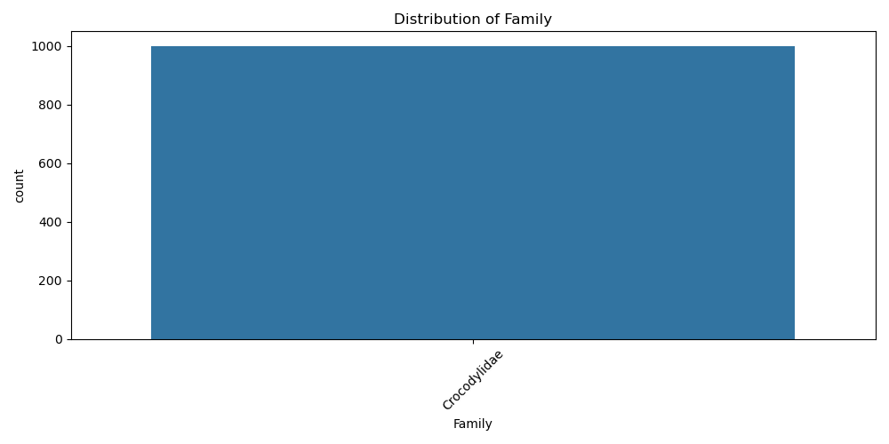
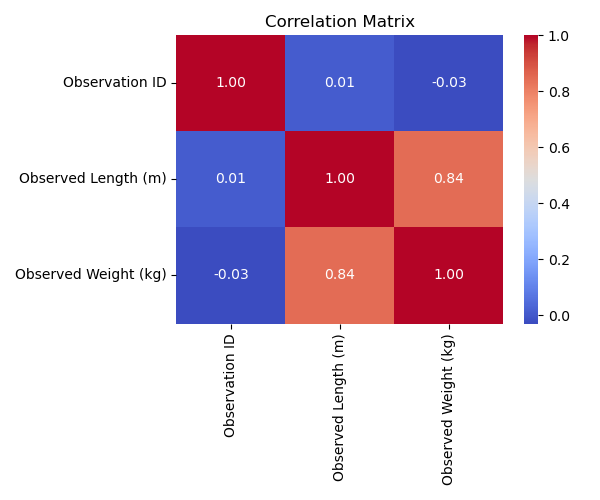
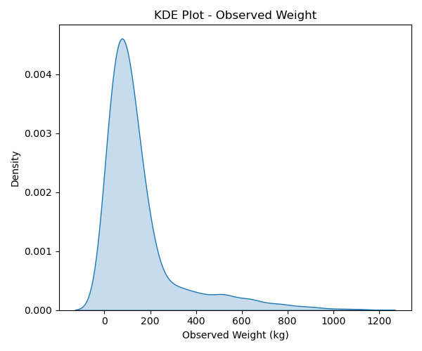
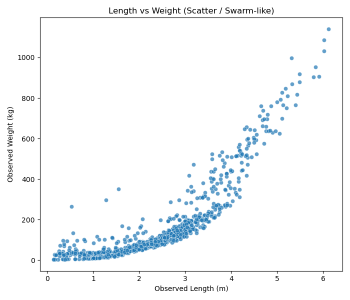
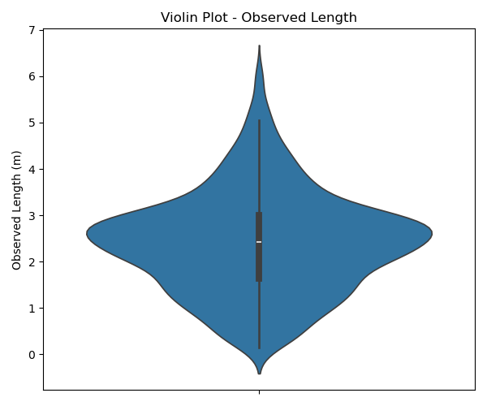

About the Dataset

This dataset contains observational records of crocodiles, including their common name, scientific name, family, observed length (in meters), and observed weight (in kilograms).
It combines categorical information (species, family) with numerical measurements (length, weight), making it useful for analyzing species distribution, size variations, and correlations between physical attributes.

Insights from Visualizations

Species Distribution: Some crocodile species are observed far more frequently than others (visible in bar plots).
Length & Weight: There is a strong positive correlation (~0.84) between observed length and weight — longer crocodiles tend to weigh more.
Outliers: Both length and weight show outliers, suggesting unusually large or small observations compared to the majority.
Variation Across Species: Boxplots and violin plots highlight size variation across different species/families.
Data Spread: KDE plots show the weight distribution is right-skewed, meaning most crocodiles weigh less, but a few very heavy ones pull the average up.

1. Species Distribution: Some crocodile species are observed more frequently than others, as shown in the bar plots.

2. Length & Weight Correlation: There is a strong positive correlation (~0.84) between length and weight — longer crocodiles generally weigh more.

3. Outliers: Both length and weight contain outliers, indicating unusually large or small crocodiles compared to the majority.

4. Variation Across Species: Boxplots and violin plots reveal differences in size distributions across species and families.

5. Weight Distribution: KDE plots show a right-skewed distribution, meaning most crocodiles are lighter, while a few very heavy ones increase the overall range.

.png>)
.png>)

